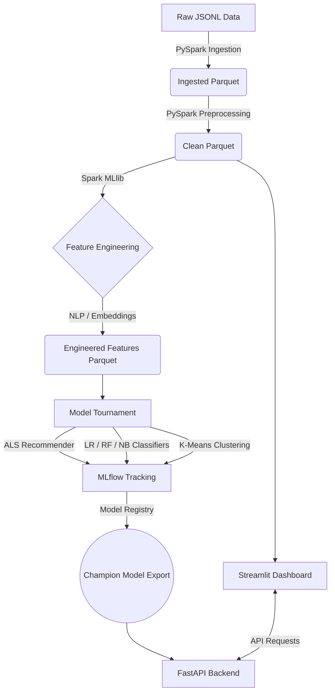

# Amazon Product Recommendation & Review Intelligence System
**Final Project Report - DATA 228**

---

## 1. Executive Summary

This project implements an end-to-end Big Data pipeline and machine learning ecosystem designed to process, analyze, and generate recommendations from the **McAuley-Lab Amazon Reviews 2023** dataset. The primary objective is to demonstrate a highly scalable architecture capable of digesting large-scale JSONL data, performing distributed feature engineering, and executing a robust model tournament. 

The resulting system features a fully functional recommendation engine powered by **Alternating Least Squares (ALS)**, sentiment and text classification models (Logistic Regression, Random Forest, Naive Bayes), and unsupervised clustering (K-Means). The entire experiment lifecycle is tracked via **MLflow**, and the finalized models and data artifacts are served through a high-performance **FastAPI** backend and an interactive **Streamlit** dashboard.

---

## 2. System Architecture

The architecture is designed to handle massive volumes of raw data through a distributed processing engine (Apache Spark) and persist intermediate states in columnar format (Parquet) for efficient downstream ML tasks.



### 2.1 Storage Layers
- **Raw JSONL**: The raw, unprocessed text and metadata directly from the source.
- **Ingested Parquet**: Initial conversion of JSONL to Parquet for faster subsequent reads and reduced storage footprint.
- **Clean Parquet**: Null values removed, schemas enforced, and noisy data filtered. This acts as the source of truth for the Streamlit dashboard analytics.
- **Engineered Features**: Features derived from text (TF-IDF/CountVectorizer) and encoded categorical variables, utilized by the classification and clustering models.

---

## 3. Data Processing & Feature Engineering Pipeline

The data pipeline is implemented as a modular set of Python scripts under `src/`, orchestrated by `start_pipeline.sh`.

### 3.1 Data Ingestion and EDA (`src/ingestion/data_loader.py`, `src/eda/eda.py`)
- **Action**: Reads massive JSONL streams using PySpark and converts them to Parquet.
- **Outcome**: Outputs the initial `data/raw/amazon_reviews.parquet` directory. EDA calculates global rating distributions and identifies viral products.

### 3.2 Data Preprocessing and Optimization (`src/preprocessing/cleaner.py`)
- **Action**: Cleanses the data by handling null values, deduplicating records, and casting data types correctly.
- **Optimization**: Applies Cold-Start Filtering (minimum 5 reviews per user and product). Writes the clean data to a compressed Parquet format (`data/processed/amazon_clean.parquet/clean_data.parquet`).

### 3.3 Feature Engineering (`src/features/feature_engineering.py`)
- **Action**: Constructs the `Spark ML` pipelines.
- **NLP Processing**: Extracts the `text` column (review body) to generate Natural Language Processing (NLP) features. This involves tokenization, stop-word removal, and vectorization (e.g., TF-IDF).
- **Categorical Encoding**: Transforms string-based user IDs and product IDs into numeric indices required by the ALS algorithm.
- **Outcome**: Saves the engineered dataset and the trained `Spark ML` feature pipeline to `models/feature_pipeline`.

---

## 4. Machine Learning & Model Tournament

The project utilizes a "Tournament" approach to evaluate multiple model architectures simultaneously (`src/models/train.py`).

### 4.1 Collaborative Filtering (Recommendation)
- **Model**: Alternating Least Squares (ALS).
- **Mechanism**: Matrix factorization technique suited for implicit/explicit feedback. It decomposes the user-item interaction matrix into lower-dimensional dense vectors to predict missing user ratings for products.
- **Evaluation**: RMSE (Root Mean Square Error) on a held-out test set.

### 4.2 Classification Models (Sentiment & Review Intelligence)
- Evaluated models: **Logistic Regression (LR)**, **Random Forest (RF)**, and **Naive Bayes (NB)**.
- **Purpose**: To classify the sentiment or helpfulness of a review based on the engineered NLP features.

### 4.3 Unsupervised Clustering
- **Model**: **K-Means Clustering**.
- **Purpose**: Groups similar reviews or products based on textual embeddings and metadata to discover hidden patterns.

### 4.4 Experiment Tracking (MLflow)
- Every run within the tournament is logged using **MLflow**.
- Metrics, hyperparameters, and model artifacts are tracked.
- The best-performing ALS model is exported for production serving to `models/als_recommendation_model`.

---

## 5. Deployment & User Interface

### 5.1 FastAPI Backend (`api/main.py`)
Provides RESTful endpoints for scalable model serving and data querying.
- `GET /health`: Health check endpoint.
- `GET /stats`: Retrieves aggregate dataset statistics from the clean Parquet files.
- `GET /users/{user_id}/top-products`: Returns the highest-rated products for a specific user.
- `POST /predict_sentiment`: Accepts raw review text and returns a sentiment score and confidence metric.

### 5.2 Streamlit Dashboard (`dashboard/app.py`)
A comprehensive, interactive UI for business intelligence and user personalization.
- **Business Dashboard**: Visualizes KPI metrics, storage layer comparisons, rating distributions, and review volume over time using Altair charts.
- **Customer Personalization**: Displays a specific user's historical review timeline, rating distribution, and top-rated products.
- **Review Intelligence**: Interfaces with the FastAPI backend (or uses robust keyword heuristics as a fallback) to provide real-time sentiment analysis on arbitrary text input.

---

## 6. Testing & CI/CD

- **Automated Test Suite**: `tests/test_pipeline.py` validates config loading, module imports, and directory structure. `tests/test_api.py` unit tests the FastAPI endpoints (health, sentiment analysis).
- **GitHub Actions**: `.github/workflows/python-app.yml` runs the test suite on every push/PR to the `main` branch.

---

## 7. Technologies Used

| Category | Technology |
| :--- | :--- |
| **Language** | Python 3.10+ |
| **Big Data Engine** | Apache Spark / PySpark (Java 17) |
| **Data Storage** | Parquet, PyArrow |
| **Machine Learning** | Spark MLlib |
| **Experiment Tracking**| MLflow |
| **Backend API** | FastAPI, Uvicorn |
| **Frontend/Dashboard** | Streamlit, Altair, Pandas |
| **DevOps** | Docker, Docker Compose, GitHub Actions, Pytest |
| **Data Source** | Hugging Face (McAuley-Lab/Amazon-Reviews-2023) |

---

## 8. Setup and Execution

To run the full pipeline:

1. **Environment Setup**:
    ```bash
    python -m venv .venv
    source .venv/bin/activate
    pip install -r requirements.txt
    ```
2. **Run the Offline Pipeline**:
    ```bash
    chmod +x start_pipeline.sh
    ./start_pipeline.sh
    ```
3. **Boot the Serving Layer (Docker)**:
    ```bash
    docker-compose up --build -d
    ```
4. **Access the Application**:
    - **Interactive Dashboard:** http://localhost:8501
    - **FastAPI Swagger UI:** http://localhost:8000/docs

---

*This report documents the design, implementation, and deployment of a scalable recommendation and analytics pipeline, fulfilling the requirements for advanced data engineering and machine learning model deployment methodologies.*
